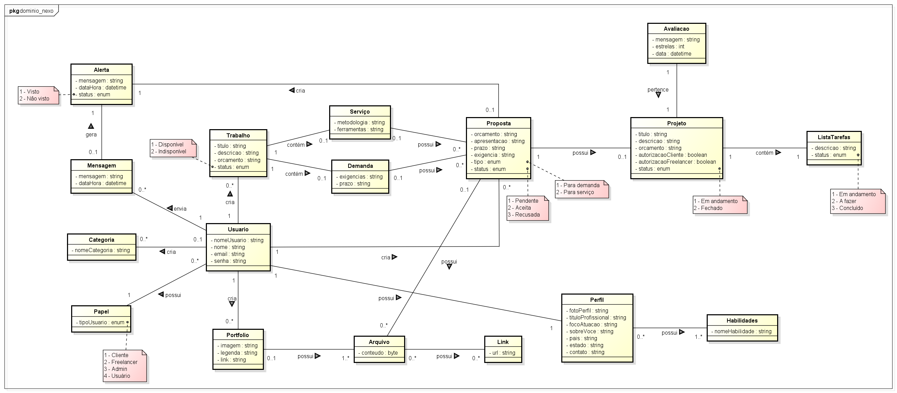

# Trabalho sobre Arquitetura Limpa: Entrega 01

O que deve ser feito:

1. A partir do diagrama de classes de domínio, **escolher 3 ou 4 classes** para serem implementadas neste trabalho.
2. Criar um projeto no VS Code **usando "Python Puro"**, sem ser um projeto Django ou Django-REST
3. Criar a modelagem das classes de domínio, dos Repositories e das interfaces DAO conforme a imagem de exemplo ([core_UML_TRABALHO.png](diagramas/core_UML_TRABALHO.png))
4. Fazer a implementação das classes e interfaces modeladas em Python

Entregar o arquivo "zipado" do projeto contendo a implementação e com a imagem do diagrama de modelagem das classes.

## Diagrama de Domínio - Nexo

## Imagem de exemplo - Core

